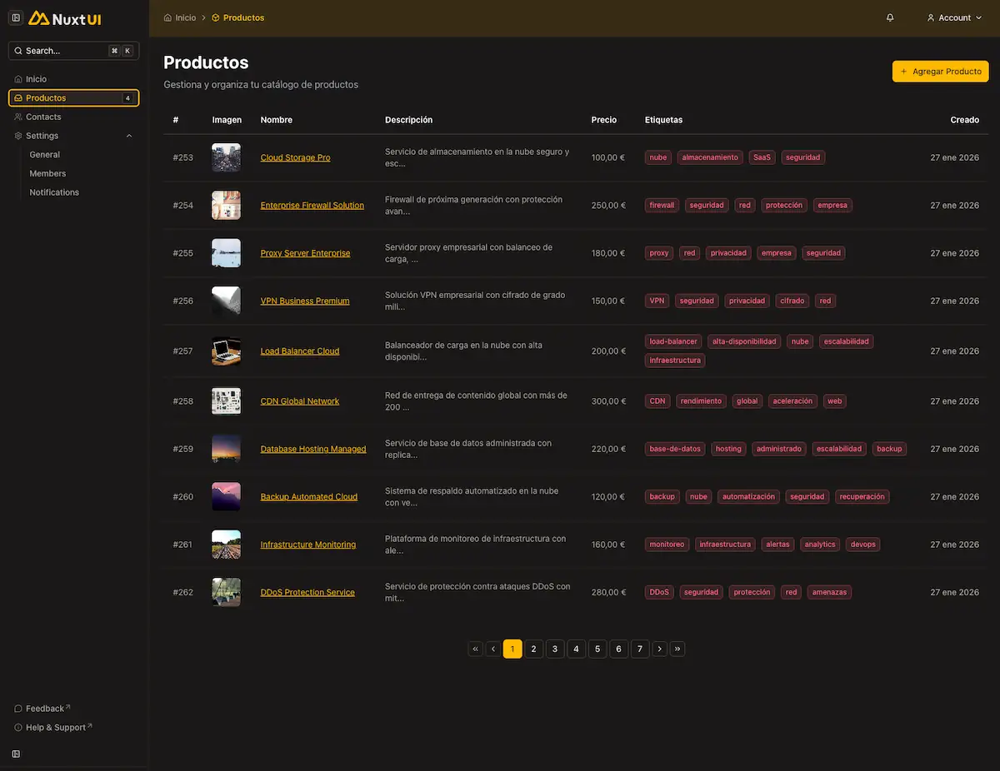

<div align="center">
  <br />
  <br />
  
  # <code>NUXT_E-COMMERCE_TRAINING</code>
  
  **MINIMALIST E-COMMERCE TEMPLATE**
  <br />

  
  
  
  
  
  


  <br />
  <br />
</div>

---

### 00 __ PREVIEW



> **ABSTRACT:** Una plataforma de comercio electrónico robusta construida con Nuxt 3, que presenta un panel de administración personalizado, gestión de productos y autenticación segura. Diseñada con un estilo de código "Brutalista" estricto para máxima legibilidad y mantenibilidad.
>
> <br />
>
> **ORIGIN:** Basado en [Nuxt 3 - The Complete Guide](https://cursos.devtalles.com/courses/nuxt-3-guia-completa) de **Fernando Herrera**.
> *Adaptado con reglas arquitectónicas estrictas y estándares de comentarios propios.*
>
> <br />
>


---

### 01 __ ARCHITECTURE & DECISIONS

| COMPONENT | TECH | NOTE |
| :--- | :--- | :--- |
| **Núcleo** | `Nuxt 3` | Composition API / Script Setup |
| **Estado** | `Composables` | Nativo `useState` / Sesión `h3` |
| **Base de datos** | `NeonDB` | PostgreSQL Serverless vía Prisma |
| **Almacenamiento** | `Cloudinary` | Optimización de Imágenes y Subidas |
| **Estilos** | `Tailwind CSS` | Utility-first / Nuxt UI |

<br>

### 02 __ INSTALLATION

*Ejecutar entorno local:*

```bash
# 1. Clonar
git clone <repository-url>

# 2. Instalar dependencias
bun install

# 3. Configurar Entorno
cp .env.template .env
# (Rellenar DATABASE_URL, NUXT_OAUTH_*, CLOUDINARY_*)

# 4. Configurar Base de Datos
bunx prisma migrate dev
bun seed

# 5. Iniciar
bun dev
```

### 03 __ KEY FEATURES

-   **Panel de Administración:** CRUD completo para productos con soporte de subida de imágenes.
-   **Autenticación:** Soporte multi-proveedor (GitHub) vía H3 y sesiones del lado del servidor.
-   **Nativo en la Nube:** Impulsado por **NeonDB** (Base de Datos) y **Cloudinary** (Activos Multimedia).
-   **Código Brutalista:** Cada componente y manejador API presenta cabeceras estandarizadas "Dog Tag" para contexto instantáneo.

A. EL GANCHO (Patrón de Manejador API)
Usando `defineEventHandler` con comentarios estrictos:

```typescript
/**
 * █ [API] :: PRODUCT_DETAIL
 * =====================================================================
 * DESC:   Fetches product by slug.
 * META:   - Caches response for performance
 * STATUS: STABLE
 * =====================================================================
 */
export default defineEventHandler(async (event) => {
  // Logic...
})
```

<div align="center">
<br />

<code>DISEÑADO Y CODIFICADO POR <a href='https://github.com/samuhlo'>samuhlo</a></code>

<small>Lugo, Galicia</small>

</div>